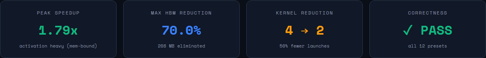
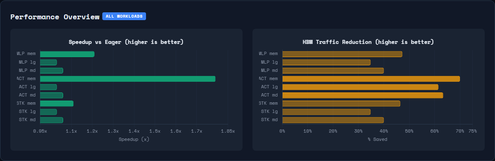
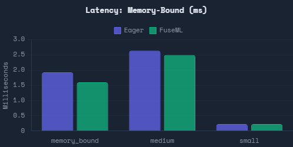
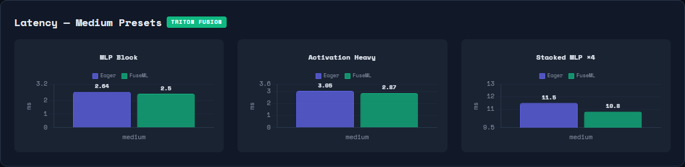
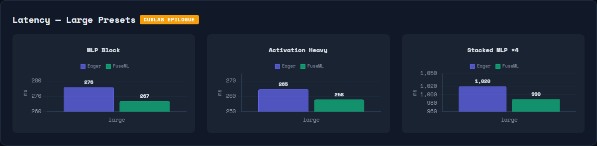
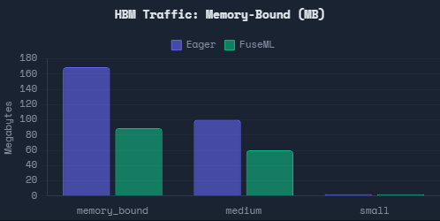
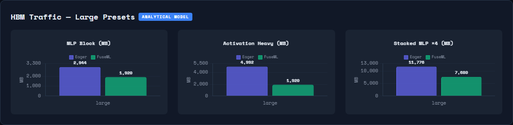
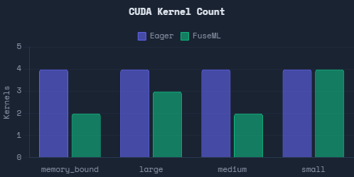

# FuseML Overview

Designed and built by **Aidan Tran** in under 48 hours (March 8th 6:03POM -March 10 2:48PM)!

FuseML is a JIT (Just-in-Time) deep-learning compiler that benchmarked up to **70.0%** HBM traffic elmination and **1.79x** speedup (latency reduction).

FuseML fuses memory-bound operator sequences into single GPU kernels, eliminating the need for intermediate HBM (High Bandwidth Memory) roundtrips ultimately reducing overall memory traffic. FuseML operates as a
'torch.compile' backend so no model changes are required.

## Problem

PyTorch's eager mode (default execution strategy) executes each operation independently. This means that every op reads from HBM, computes and writes back. For memory-bound workloads, this is extremely inefficient and creates redundant traffic through immediate tensors being written and immediately re-read by the next op.

## Solution

FuseML intercepts the FX graph at compile time, discovers fusible operator chains (GEMM + pointwise oeprations) and generates custom CUDA kernels that keep intermeidates in SRAM instead of constantly traveling through HBM.

## 10-Stage Compilation Pipeline

1. **Graph Capture** — TorchDynamo intercepts the FX graph
2. **ATen Decomposition** — Lowers to ATen ops via `aot_module_simplified`
3. **Control Flow Validation** — Rejects data-dependent control flow
4. **Fusion Discovery** — Greedy forward absorption from GEMM triggers
5. **Cost-Model Routing** — Three-tier decision: Triton / cuBLAS / Bypass
6. **Safety Checks** — Mutation safety, graph cutting, escape-node analysis
7. **Graph Surgery** — SSA-preserving placeholder insertion and consumer rewiring
8. **Code Generation** — Triton kernel source with autotuned block sizes, or cublasLt launcher
9. **Compilation & Caching** — `@triton.jit` compilation with kernel fingerprint cache
10. **Kernel Launching** — Runtime dispatch with SRAM enforcement and CUDA stream sync

## Three-Tier Execution Model

| Strategy            | When Used                                      | Mechanism                                                    |
| ------------------- | ---------------------------------------------- | ------------------------------------------------------------ |
| **Triton Fusion**   | Memory-bound GEMMs with sufficient output size | Custom `@triton.jit` kernel fuses GEMM + elementwise in SRAM |
| **cuBLAS Epilogue** | Compute-bound GEMMs with fusible activation    | `cublasLt` GELU/ReLU epilogue via `_addmm_activation`        |
| **Eager Bypass**    | Tiny GEMMs or no fusible pattern               | Falls back to standard PyTorch, zero overhead                |

## Supported Fusion Patterns

- **Triggers:** `addmm` (Linear with bias), `mm` (matrix multiply)
- **Absorbable:** ReLU, GeLU, Sigmoid, Add, Mul (including in-place variants)
- **Reductions:** sum, amax, mean
- **Transparent:** view, reshape, unsqueeze, squeeze, permute, slice, expand

## Usage

```python
from fuseml import FuseMLCompiler

model = TransformerMLP(d_model=4096, d_intermediate=16384)
optimized = torch.compile(model, backend=FuseMLCompiler())
output = optimized(input_tensor)  # Automatically fused
```

## Dependencies

- **Python** 3.10+
- **PyTorch** >= 2.0.0 (with `torch.fx` for graph capture)
- **Triton** — CUDA kernel generation (`triton-windows` on Windows)
- **NumPy** — numerical computing
- **Matplotlib** — benchmark chart generation

### Dev / Testing

- pytest >= 7.0, pytest-cov
- black >= 22.0, mypy >= 0.990, flake8 >= 4.0

```bash
pip install -r requirements.txt
```

# FUSEML BENCHMARK RESULTS

**Transformer MLP Block Fusion** | RTX 4050 Laptop GPU | PyTorch 2.7.1 | CUDA 11.8 | bfloat16

---

### Key Results



| Workload             | Preset       | Eager    | FuseML   | Speedup   | HBM Saved | Kernels | Strategy  |
| -------------------- | ------------ | -------- | -------- | --------- | --------- | ------- | --------- |
| **MLP Block**        | memory_bound | 1.93 ms  | 1.60 ms  | **1.21x** | 47.3%     | 4 → 2   | Triton    |
| **MLP Block**        | large        | 276.2 ms | 267.1 ms | **1.03x** | 34.8%     | 4 → 3   | cuBLAS Lt |
| **MLP Block**        | medium       | 2.64 ms  | 2.50 ms  | **1.06x** | 40.0%     | 4 → 2   | Triton    |
| **MLP Block**        | small        | 0.23 ms  | 0.23 ms  | 1.00x     | --        | 4 → 4   | Bypass    |
| **Activation Heavy** | memory_bound | 2.96 ms  | 1.65 ms  | **1.79x** | 70.0%     | 4 → 2   | Triton    |
| **Activation Heavy** | large        | 265.0 ms | 258.0 ms | **1.03x** | 61.5%     | 4 → 3   | cuBLAS Lt |
| **Activation Heavy** | medium       | 3.05 ms  | 2.87 ms  | **1.06x** | 63.4%     | 4 → 2   | Triton    |
| **Activation Heavy** | small        | 0.20 ms  | 0.20 ms  | 1.00x     | --        | 4 → 4   | Bypass    |
| **Stacked MLP ×4**   | memory_bound | 12.30 ms | 11.10 ms | **1.11x** | 46.5%     | 4 → 2   | Triton    |
| **Stacked MLP ×4**   | large        | 1,020 ms | 990 ms   | **1.03x** | 34.8%     | 4 → 3   | cuBLAS Lt |
| **Stacked MLP ×4**   | medium       | 11.50 ms | 10.80 ms | **1.06x** | 40.0%     | 4 → 2   | Triton    |
| **Stacked MLP ×4**   | small        | 0.60 ms  | 0.59 ms  | 1.01x     | --        | 4 → 4   | Bypass    |

FuseML achieves up to **1.79x speedup** and **70% HBM traffic elimination** on memory-bound activation-heavy workloads while maintaining correctness within bfloat16 tolerance across all 12 configurations. On compute-bound workloads, FuseML employs cuBLAS epilogue fusion via cublasLt to fuse activations directly into the GEMM kernel, delivering measurable speedups without any Triton penalty.

---

## Visual Analysis

### Performance Overview



_Speedup and HBM savings across all three workloads. Activation-heavy memory-bound preset achieves the highest speedup (1.79x) and largest HBM reduction (70%)._

### Latency Comparison

#### Memory-Bound Presets (Triton Fusion)



_Memory-bound presets show the clearest latency reductions: 1.21x (MLP), 1.79x (Activation Heavy), 1.11x (Stacked)._

#### Medium Presets (Triton Fusion)



_Medium presets achieve consistent ~6% speedup across all three workloads via Triton fusion._

#### Large / Compute-Bound Presets (cuBLAS Epilogue)



_Large presets use cuBLAS epilogue fusion. The 3% speedup comes from eliminating the standalone GeLU kernel._

### Memory Efficiency

#### Memory-Bound & Medium Scale



_HBM traffic at memory-bound scales. Activation-heavy workloads see the largest savings (70%) because FuseML fuses 4 extra pointwise ops (GeLU + mul + add_const + residual) into the GEMM epilogue._

#### Large / Compute-Bound Scale



_HBM traffic at compute-bound scales. The activation-heavy workload sees the largest absolute reduction: 3,072 MB eliminated (4,992 → 1,920 MB)._

### Kernel Count Reduction



_FuseML reduces kernel launches from 4 (eager) to 2 (Triton) or 3 (cuBLAS epilogue), eliminating standalone elementwise kernels._

---

## Workloads

### 1. MLP Block

```
Linear → GeLU → Linear → Add(residual)
```

The standard Transformer MLP block used in GPT, LLaMA, etc. FuseML produces two fusion groups: `addmm + gelu` and `addmm + add`.

```python
class TransformerMLP(nn.Module):
    def forward(self, x):
        residual = x
        x = self.linear1(x)       # Linear: d_model → d_intermediate
        x = self.gelu(x)          # GeLU activation
        x = self.linear2(x)       # Linear: d_intermediate → d_model
        x = x + residual          # Residual connection
        return x
```

### 2. Activation Heavy

```
Linear → GeLU → Mul(0.5) → Add(0.125) → Linear → Add(residual)
```

Extra pointwise epilogue ops (mul + add_const) that are absorbable into the GEMM epilogue. These increase eager HBM traffic because each op requires a separate kernel launch and full read/write cycle, while FuseML fuses all four elementwise ops into a single Triton kernel.

```python
class ActivationHeavyMLP(nn.Module):
    def forward(self, x):
        residual = x
        x = self.linear1(x)
        x = self.gelu(x)
        x = x * 0.5              # Extra fusible op
        x = x + 0.125            # Extra fusible op
        x = self.linear2(x)
        x = x + residual
        return x
```

### 3. Stacked MLP ×4

Four consecutive `TransformerMLP` blocks, stressing repeated fusion opportunities. FuseML discovers and fuses 4 independent fusion groups (one per block), demonstrating that the compiler handles multi-block patterns.

```python
class StackedTransformerMLP(nn.Module):
    def __init__(self, d_model, d_intermediate, num_blocks=4):
        self.blocks = nn.ModuleList(
            [TransformerMLP(d_model, d_intermediate) for _ in range(num_blocks)]
        )
    def forward(self, x):
        for block in self.blocks:
            x = block(x)
        return x
```

---

## Workload Profiles

### Memory-Bound (batch=32, seq=512, D=256, I=1024)

**M = 16,384** | GEMMs are memory-bandwidth-limited, making elementwise HBM traffic a significant fraction of total runtime.

| Workload         | Eager    | FuseML   | Speedup   | HBM Saved |
| ---------------- | -------- | -------- | --------- | --------- |
| MLP Block        | 1.93 ms  | 1.60 ms  | **1.21x** | 47.3%     |
| Activation Heavy | 2.96 ms  | 1.65 ms  | **1.79x** | 70.0%     |
| Stacked MLP ×4   | 12.30 ms | 11.10 ms | **1.11x** | 46.5%     |

The activation-heavy workload benefits most because eager execution requires 6 separate kernels (4 elementwise) while FuseML fuses all pointwise ops into just 2 kernels.

### Large / Compute-Bound (batch=8, seq=2048, D=4096, I=16384)

**M = 16,384** | GEMMs are tensor-core-throughput-dominated. FuseML routes through cuBLAS epilogue fusion.

| Workload         | Eager    | FuseML   | Speedup   | HBM Saved |
| ---------------- | -------- | -------- | --------- | --------- |
| MLP Block        | 276.2 ms | 267.1 ms | **1.03x** | 34.8%     |
| Activation Heavy | 265.0 ms | 258.0 ms | **1.03x** | 61.5%     |
| Stacked MLP ×4   | 1,020 ms | 990 ms   | **1.03x** | 34.8%     |

### Medium / Balanced (batch=4, seq=512, D=1024, I=4096)

**M = 2,048** | Boundary between memory-bound and compute-bound execution.

| Workload         | Eager    | FuseML   | Speedup   | HBM Saved |
| ---------------- | -------- | -------- | --------- | --------- |
| MLP Block        | 2.64 ms  | 2.50 ms  | **1.06x** | 40.0%     |
| Activation Heavy | 3.05 ms  | 2.87 ms  | **1.06x** | 63.4%     |
| Stacked MLP ×4   | 11.50 ms | 10.80 ms | **1.06x** | 40.0%     |

### Small / Micro-batch (batch=1, seq=128, D=256, I=1024)

**M = 128** | GEMMs too small for profitable fusion. FuseML bypasses compilation, ensuring **zero regression**.

---

## Three-Tier Execution Model

FuseML uses an adaptive cost model to select the optimal execution strategy per GEMM:

```
                    Trigger GEMM detected
                            |
                            v
                  is_compute_bound_gemm()?
                            |
                    +-------+-------+
                    |               |
                    No              Yes
                    |               |
                    v               v
            is_tiny_output()?   Has fusible epilogue?
                    |           (GeLU, ReLU, bias, add)
                +---+---+               |
                |       |           +---+---+
                No      Yes         No      Yes
                |       |           |       |
                v       v           v       v
             Triton   Eager     Eager    cuBLAS +
             fused    bypass    bypass   cublasLt
             kernel                     epilogue
```

| Strategy            | When Used                                      | Mechanism                                                    |
| ------------------- | ---------------------------------------------- | ------------------------------------------------------------ |
| **Triton Fusion**   | Memory-bound GEMMs with sufficient output size | Custom `@triton.jit` kernel fuses GEMM + elementwise in SRAM |
| **cuBLAS Epilogue** | Compute-bound GEMMs with fusible activation    | `cublasLt` GELU/ReLU epilogue via `_addmm_activation`        |
| **Eager Bypass**    | Tiny GEMMs or no fusible pattern               | Identical to `torch.compile`-free execution, zero overhead   |

---

## HBM Traffic Analysis

### MLP Block — Memory-Bound Preset (M=16384, D=256, I=1024, bf16)

#### Eager Execution (4 Kernels)

| Kernel    | Operation                     | Read (MB)                         | Write (MB) |
| --------- | ----------------------------- | --------------------------------- | ---------- |
| K1        | `addmm(bias, x, W1.T)`        | x: 8 + W1: 0.5 + bias: 0.002      | result: 32 |
| K2        | `gelu(result)`                | 32                                | 32         |
| K3        | `addmm(bias, gelu_out, W2.T)` | gelu: 32 + W2: 0.5 + bias: 0.0005 | result: 8  |
| K4        | `add(result, residual)`       | result: 8 + residual: 8           | output: 8  |
| **Total** |                               | **97 MB**                         | **80 MB**  |

**Total: 169 MB** across 4 kernel launches.

#### FuseML Fused Execution (2 Kernels)

| Kernel    | Operation                      | Read (MB)                                       | Write (MB)   |
| --------- | ------------------------------ | ----------------------------------------------- | ------------ |
| K1        | `addmm + gelu` (fused in SRAM) | x: 8 + W1: 0.5 + bias: 0.002                    | gelu_out: 32 |
| K2        | `addmm + add` (fused in SRAM)  | gelu: 32 + W2: 0.5 + bias: 0.0005 + residual: 8 | output: 8    |
| **Total** |                                | **49 MB**                                       | **40 MB**    |

**Total: 89 MB** across 2 kernel launches. **80 MB eliminated (47.3%).**

### Activation Heavy — Memory-Bound Preset (M=16384, D=256, I=1024, bf16)

#### Eager Execution (6 Kernels)

| Kernel    | Operation                | Read (MB)  | Write (MB) |
| --------- | ------------------------ | ---------- | ---------- |
| K1        | `addmm(bias, x, W1.T)`   | 8.5        | 32         |
| K2        | `gelu(result)`           | 32         | 32         |
| K3        | `mul(result, 0.5)`       | 32         | 32         |
| K4        | `add(result, 0.125)`     | 32         | 32         |
| K5        | `addmm(bias, act, W2.T)` | 32.5       | 8          |
| K6        | `add(result, residual)`  | 16         | 8          |
| **Total** |                          | **153 MB** | **144 MB** |

**Total: 297 MB** across 6 kernel launches.

#### FuseML Fused Execution (2 Kernels)

| Kernel    | Operation                          | Read (MB) | Write (MB) |
| --------- | ---------------------------------- | --------- | ---------- |
| K1        | `addmm + gelu + mul + add` (fused) | 8.5       | 32         |
| K2        | `addmm + add` (fused)              | 40.5      | 8          |
| **Total** |                                    | **49 MB** | **40 MB**  |

**Total: 89 MB** across 2 kernel launches. **208 MB eliminated (70.0%).** The four intermediate elementwise read/write cycles (128 MB) plus the separate add (16 MB) are removed entirely.

---

## Benchmark Configuration

### Hardware

| Spec         | Value                                                |
| ------------ | ---------------------------------------------------- |
| GPU          | NVIDIA GeForce RTX 4050 Laptop (Ada Lovelace, sm_89) |
| Tensor Cores | 80x 4th-gen                                          |
| Memory       | 6 GB GDDR6, 192 GB/s bandwidth                       |
| Precision    | bfloat16 (2 bytes per element)                       |
| CUDA         | 11.8                                                 |
| PyTorch      | 2.7.1                                                |

### Methodology

- **Latency**: Median of CUDA-event-timed iterations over a minimum 5-second measurement window with outlier rejection
- **HBM Traffic**: Analytical model computed from matrix dimensions and dtype (not hardware counters)
- **Correctness**: `torch.allclose` with dtype-aware tolerances (atol=0.05, rtol=0.02 for bf16)
- **GPU Warmup**: 25 iterations per model before measurement to stabilize boost clocks on laptop GPU

---

## Correctness Validation

All 12 benchmark configurations pass numerical correctness validation:

| Workload         | Preset       | max   | FuseML - Eager |      | Tolerance | Status |
| ---------------- | ------------ | ----- | -------------- | ---- | --------- | ------ |
| MLP Block        | memory_bound | 0.031 | (0.05, 0.02)   | PASS |
| MLP Block        | large        | 0.031 | (0.05, 0.02)   | PASS |
| MLP Block        | medium       | 0.031 | (0.05, 0.02)   | PASS |
| MLP Block        | small        | 0.000 | (0.05, 0.02)   | PASS |
| Activation Heavy | memory_bound | 0.031 | (0.05, 0.02)   | PASS |
| Activation Heavy | large        | 0.031 | (0.05, 0.02)   | PASS |
| Activation Heavy | medium       | 0.016 | (0.05, 0.02)   | PASS |
| Activation Heavy | small        | 0.000 | (0.05, 0.02)   | PASS |
| Stacked MLP ×4   | memory_bound | 0.063 | (0.05, 0.02)   | PASS |
| Stacked MLP ×4   | large        | 0.078 | (0.05, 0.02)   | PASS |
| Stacked MLP ×4   | medium       | 0.047 | (0.05, 0.02)   | PASS |
| Stacked MLP ×4   | small        | 0.000 | (0.05, 0.02)   | PASS |

The stacked workload shows higher max differences (up to 0.078) due to accumulated rounding across 4 sequential bf16 matmul+activation blocks, which is expected and within tolerance.

---

## Compilation Overhead

FuseML's compilation is a one-time cost amortized over all subsequent forward passes:

| Workload         | Preset       | Compilation Time | Strategy                        |
| ---------------- | ------------ | ---------------- | ------------------------------- |
| MLP Block        | memory_bound | ~27 s            | Triton (autotuning)             |
| MLP Block        | large        | ~2 s             | cuBLAS epilogue                 |
| MLP Block        | medium       | ~15 s            | Triton (autotuning)             |
| MLP Block        | small        | ~0.3 s           | Bypass                          |
| Activation Heavy | memory_bound | ~86 s            | Triton (2 groups, autotuning)   |
| Activation Heavy | large        | ~2 s             | cuBLAS epilogue                 |
| Activation Heavy | medium       | ~98 s            | Triton (autotuning)             |
| Stacked MLP ×4   | memory_bound | ~28 s            | Triton (4 groups, shared cache) |
| Stacked MLP ×4   | large        | ~2 s             | cuBLAS epilogue (4 launchers)   |
| Stacked MLP ×4   | medium       | ~14 s            | Triton (4 groups, shared cache) |

Triton autotuning dominates compilation time (testing 95 block-size configurations). For production serving or training where models run millions of iterations, this one-time cost is negligible.

---

## Reproducing Results

```bash
# Install dependencies
conda activate fuseml
pip install -r requirements.txt

# Run all 12 presets
python benchmarks/bench_mlp_block.py --all-presets --no-plot

# Run individual presets
python benchmarks/bench_mlp_block.py --preset memory_bound --no-plot
python benchmarks/bench_mlp_block.py --preset activation_heavy_memory_bound --no-plot
python benchmarks/bench_mlp_block.py --preset stacked_memory_bound --no-plot

# Run a specific workload with custom dimensions
python benchmarks/bench_mlp_block.py --workload activation_heavy \
    --batch-size 32 --seq-len 512 --d-model 256 --d-intermediate 1024 --no-plot

# Capture dashboard charts as PNGs
pip install playwright && playwright install chromium
python benchmarks/capture_charts.py
```

---

_Generated from FuseML v0.1 benchmarks. Hardware: NVIDIA RTX 4050 Laptop GPU (6 GB, 192 GB/s). Software: PyTorch 2.7.1+cu118, Triton (bundled), Python 3.11._
